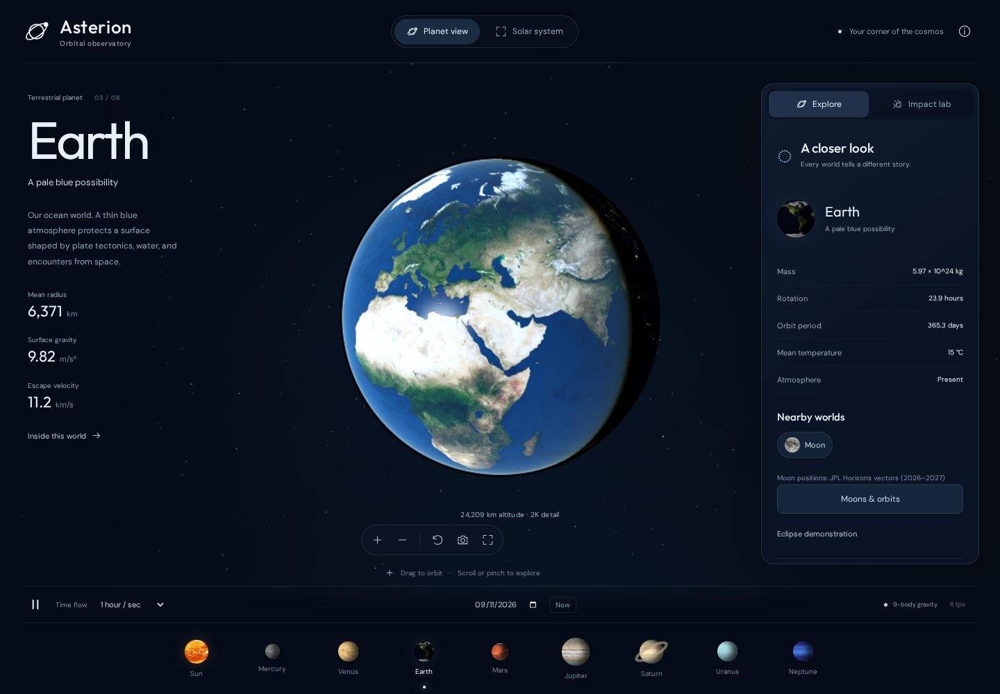
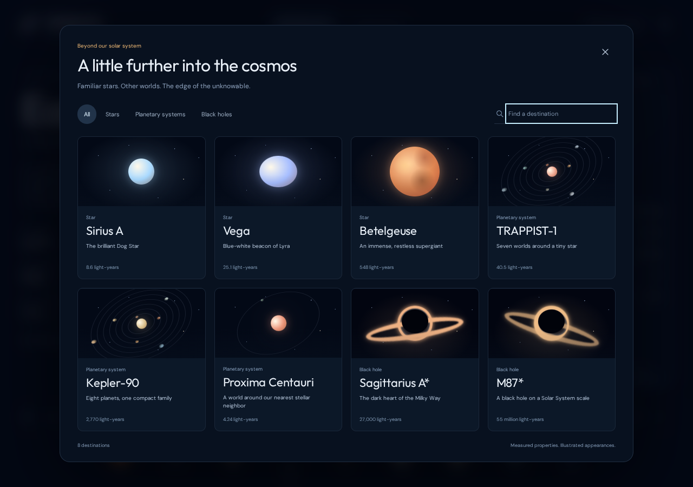

# Asterion

A locally hosted 3D orbital observatory and asteroid-impact laboratory. Built with TypeScript, Three.js, custom planet/atmosphere shaders, and a separate numerical physics module. No API keys, telemetry, account, or external runtime assets.



## Run in Docker

From this directory:

```powershell
docker compose up -d --build web
```

Open **http://localhost:8787**. The single long-lived service is `asterion-web-1`, bound to loopback. Docker restarts it automatically. The container serves the production build through Nginx; simulation runs on the viewing device's GPU/CPU.

```powershell
docker compose ps
docker compose logs --tail 30 web
docker compose stop web
```

## Private Tailscale access

Find your host's Tailscale IPv4 address with `tailscale ip -4`. Once the private Serve route is enabled, open `http://<your-tailscale-ip>:8787` from a device connected to the same tailnet. Docker stays loopback-bound. There is no public Funnel or broad firewall exception.

To enable only this route, after inspecting existing routes:

```powershell
tailscale serve status
tailscale serve --bg --tcp 8787 tcp://127.0.0.1:8787
```

To remove only this route: `tailscale serve --tcp 8787 off`. Do not reset all Serve configuration; other projects use it.

## Explore

- Visit the Sun, all eight planets, and eight major moons. On a phone, swipe the destination dock to reach the outer worlds; Explore lists each planet’s moons.
- Drag to orbit; scroll or pinch to zoom. The + / − buttons and camera reset provide alternatives.
- Solar system view offers readable spacing or true sizes & orbits, plus oblique, top-down, edge-on, inner-system, and asteroid-belt cameras. True scale uses one AU-based conversion for both orbital distances and every body radius, including the Sun. Planet disks can be subpixel: use labels or destinations for close-ups. Readable mode enlarges body sizes. Moon-system views preserve actual relative radii and distances.
- The main asteroid belt is visible between Mars and Jupiter. Toggle **Asteroid belt** in Solar system settings, or choose **Asteroid belt** in the camera menu for a closer view. Pause and time-flow controls also govern the belt.
- Set the simulation date and time speed, pause, or return to now. Space toggles pause; brackets change worlds.
- Close-ups stream local tiles up to **16K for Earth and the Moon**, **8K for Mercury, Mars and Venus’s revealed surface**, and the actual source limits elsewhere. The altitude/detail readout shows refinement and source limits.
- Earth, Moon and Mars use measured elevation with no vertical exaggeration. Explore includes cloud visibility, Venus surface reveal, terrain and detail toggles, and adaptive GPU resolution. Earth has a separate cloud deck, cloud shadows, night lights, ocean glint and a scattering atmosphere.
- Explore the Moon, Io, Europa, Ganymede, Callisto, Titan, Enceladus and Triton. Moon positions use bundled JPL Horizons vectors during 2026–2027. Try the explicitly staged Io eclipse to see umbra/penumbra shadows.
- Impact lab supports **1 m–100 km** diameters, **11–72 km/s** entry speeds, **5–90°** entry angles, and stony/iron/icy composition. Historical-size presets are adjustable experiments, not reconstructions of their original locations.
- Choose an impact site and tap the globe, then launch. Watch the irregular rock, fragmentation when applicable, energy flash, crater excavation, plume and ballistic ejecta. Orbital time pauses during the encounter.
- Pause, slow down or scrub the 18-second sequence. The tracking camera starts on the incoming rock and hands off to the impact site. Switch among rock, impact-site, whole-world and debris-trajectory cameras. The readout tracks explicit ejected mass, returned mass and escape trajectories. **Explore aftermath** reopens the timeline after completion; resuming orbital time closes the event and restarts planetary rotation.
- Results include atmospheric energy deposition, arrival speed, crater estimates, an entry profile, and model-specific limitations. Replay does not create another history entry or scar.
- The last 20 encounters persist in local storage in the current browser/origin. Export them as JSON. Scars last for the current page session (the latest eight per world).
- Image capture downloads the 3D view. Sound is optional and represents an interface cue.

### Explore beyond

Choose **Explore beyond** in the header to open a separate, searchable destination library. Filter by **Stars**, **Planetary systems**, or **Black holes**; the familiar Solar System controls stay together in their existing view. The same library is available on a phone.



- Visit **Sirius A**, **Vega**, and **Betelgeuse**, and compare their sizes with our Sun.
- Explore all seven **TRAPPIST-1** planets, eight **Kepler-90** planets, and **Proxima b**. Select a world in the bottom dock or tap its label for a close-up; **Overview** returns to its system. Switch between readable spacing and **True sizes & orbits**.
- Orbit **Sagittarius A\*** and **M87\*** to inspect illustrative accretion disks and gravitational lensing.

Drag, pinch, zoom, pause, and save images as before. **About this destination → Sources & model** explains the measurements and visual assumptions. **Solar system** returns home and restores your previous Solar System time settings; exploration uses its own elapsed time. Asteroid experiments remain in the Solar System's Impact lab.

## Physics and accuracy

This is a scientific exploration app with an explicitly simplified impact model. It is **not** a high-precision ephemeris, validated hazard predictor, or shock-hydrodynamics solver.

### Solar system

Nine mutually interacting Newtonian point masses (Sun + eight planets), in AU, days, and solar masses. Velocity-Verlet steps never exceed 0.125 day. Initial positions and centered-difference velocities are derived from JPL SSD's approximate Keplerian elements and century rates. Initial dates are restricted to 1800–2050. Earth represents the Earth–Moon barycenter approximately, without a separate Moon mass. No relativity, tides, or small-body perturbations. Moon trajectories are displayed separately and do not add masses to this nine-body integrator. UTC approximates ephemeris time. This is suitable for exploration, not spacecraft navigation.

Close-ups normalize the planet radius, retain rotation periods and approximate obliquities, and illuminate surfaces from the sunward direction. Prime-meridian alignment, spin-axis directions, seasons, cloud motion, and planetary reference orbit guides are approximate or illustrative. Eight moon trajectories use planet-centered JPL Horizons states with cubic Hermite interpolation during 2026–2027; fixed approximate Keplerian orbits and illustrative phases are used outside that window. Moon orbit guides sample the same trajectory source. Eclipse shading computes solar and occluder angular disk overlap; the Io demonstration is deliberately aligned, not a historical event. The asteroid belt uses a reproducible population of inclined Keplerian orbits with semimajor axes from 2.2–3.2 AU. It follows simulation time and remains visible in both distance scales. Its enlarged markers show a population illustration, not observed positions of individually catalogued asteroids, and it does not perturb the planets. Impacts do not change a planet's mass, spin, orbit, or global structure.

### Beyond the Solar System

The eight destinations use a static catalogue of published measurements and explicit estimates. Exoplanet orbits solve Kepler's equation independently; their circular, coplanar arrangement and starting phases are illustrative. They are not dated ephemerides or interacting N-body integrations. Real scale uses proportional body radii and orbital distances, while readable mode enlarges worlds.

Stellar surface patterns and every exoplanet surface are illustrations. Proxima b has an estimated radius and a measured minimum mass; no ocean or atmosphere is implied. Black holes use a nonrotating Schwarzschild reference radius with approximate light bending and illustrative gas emission, not a full general-relativity or accretion-flow solution. [Catalogue measurements, primary sources, and model limits](docs/cosmic-sources.md) document each destination.

### Impact entry

SI units. Spherical initial mass `m = density × πD³/6`; entry energy `E = ½mv²`. Speed is specified at the model's entry altitude, not at infinity. Gravity is `GM/r²`. The descent uses 100 m maximum altitude steps and 0.1 s maximum time steps with exponential atmospheres, drag coefficient 1, heat-transfer coefficient 0.02, ablation, and dynamic-pressure fragmentation. Fragment cloud radius expands up to seven initial radii. Descent angle is constant; skip-out is not resolved. The solver ends at the surface, after hypervelocity is lost, after near-total ablation, or at a finite iteration limit. The latter is a safeguard, not a physical termination condition.

Material assumptions: stone density 3,000 kg/m³, strength 1 MPa; iron 7,800 kg/m³, 50 MPa; ice 1,000 kg/m³, 0.1 MPa. Ablation energies: 8 MJ/kg for rock/iron and 3 MJ/kg for ice. These are uncertain bulk approximations, not measurements of a specific asteroid.

### Craters and visualization

Dry-rock, gravity-regime transient crater diameter follows Collins, Melosh & Marcus (2005), equation 21. Simple/complex transition is scaled with gravity. Planetary target rock densities and atmosphere profiles are representative. Oceans, detailed target geology/strength, global climate, tsunamis, basin collapse, and disruption are outside the model. For gas/ice giants, atmosphere extrapolation is illustrative; no solid crater is reported.

Craters use the estimated physical diameter and depth in a locally refined surface patch. Their bowls and rims remain idealized. Very large deformations are visually capped at 0.35 radian radius and 5% of world radius; basin collapse and global destruction are not simulated. The incoming trajectory, fragmentation shapes, flash, shock ring and vapor/dust plume are cinematic effects. Small incoming rocks and particle markers have minimum display sizes. The entry profile chart uses the numerical descent result.

### Ballistic ejecta

Excavated mass packets follow inverse-square planet gravity using adaptive fourth-order Runge–Kutta integration in SI units. An approximate spherical drag force acts in atmospheres. Launch speeds follow an assumed power-law cumulative mass distribution `M(>v) ∝ v⁻¹·⁶⁵`, angles span 35–60°, and the normalization is capped by an idealized excavation volume and **15% of surface impact energy**. Excavation density is a representative 2,750 kg/m³; drag uses 3,000 kg/m³ fragments with fixed representative sizes. These are reduced-order assumptions, not calibrated predictions for each target’s geology.

Each packet carries explicit mass. Energy and periapsis determine whether material escapes, returns to the surface, or could remain in orbit. Negative orbital energy alone does not make a stable satellite. Atmospheric drag can change these classifications. Packet paths are precomputed over a bounded 1-minute to 6.7-hour horizon and the playback compresses that physical timescale; returning/escaping percentages are model estimates. Touch devices use fewer representative packets.

The transport model omits a rotating atmosphere, planetary rotation during flight, other bodies’ gravity, self-gravity, fragment ablation, collisions, tidal breakup, accretion and target recoil. **It does not simulate the formation of a new moon.** Demonstrating that accurately would require an interacting debris-disk/hydrodynamic model. Quantitative impact outcomes remain uncertain; relevant warnings appear with each result.

Sources:

- [JPL approximate planetary positions and elements](https://ssd.jpl.nasa.gov/planets/approx_pos.html)
- [JPL planetary physical parameters](https://ssd.jpl.nasa.gov/planets/phys_par.html)
- [NASA Dawn: asteroid belt distribution](https://science.nasa.gov/mission/dawn/faq/)
- [JPL Horizons system](https://ssd.jpl.nasa.gov/horizons/)
- [JPL satellite physical parameters](https://ssd.jpl.nasa.gov/sats/phys_par/)
- [Imagery and measured-elevation provenance](ASSETS.md)
- [Collins, Melosh & Marcus (2005), Earth Impact Effects Program](https://doi.org/10.1111/j.1945-5100.2005.tb00157.x)
- [NASA planetary fact sheets](https://nssdc.gsfc.nasa.gov/planetary/factsheet/)

## Verification

The production Docker build runs the numerical/asset tests and TypeScript checks before building. Browser tests run in a separate disposable Playwright container, with software WebGL rendering, no host ports, and a 1 GB shared-memory allocation:

```powershell
docker compose --profile test build tests
docker compose --profile test run --rm tests
```

Numerical, asset, and rendering tests cover physical body/orbit proportions, catalogue consistency, Schwarzschild reference radii, focus and resource disposal, terrain streaming and zoom continuity, belt placement, Kepler periods, debris energy and mass budgets, eclipses, bundled imagery and ephemerides, nine-body conservation, and impact outcomes. Browser tests exercise the Solar System, impact playback, touch targeting and pinch zoom, every cosmic destination, library search and keyboard navigation, mobile layout, true-scale close-ups, Sun comparisons, image capture, and returning home with time settings preserved. Screenshots are saved under `test-results/`.

Local development (Node 24+): `npm ci`, `npm test`, `npm run dev`. Local Vite binds 127.0.0.1. Docker is the canonical running application.

## Assets

NASA, NOAA and Solar System Scope / INOVE provide the imagery and measured terrain. Solar System Scope material is used under [CC BY 4.0](https://creativecommons.org/licenses/by/4.0/). All processing, source resolution limits, licenses and regeneration commands are recorded in [ASSETS.md](ASSETS.md). Fonts are locally bundled from Fontsource under SIL Open Font License. The renderer adds documented lighting and cinematic effects.

### Rendering continuity

Streamed imagery blends from its resident parent over 450 ms on a common terrain lattice. Loaded detail stays resident through zoom reversals; only branches entirely behind the limb fold back to free cache space. The base globe remains the sole surface until both root tiles are ready, and a complete parent covers pending or failed children. Terrain has no artificial depth offset into the cloud deck. Atmosphere ray marching uses the final camera pose each frame. Ocean reflection uses a broad GGX rough-water approximation with dielectric Fresnel reflectance; it is not a dated wind or sea-state model.
